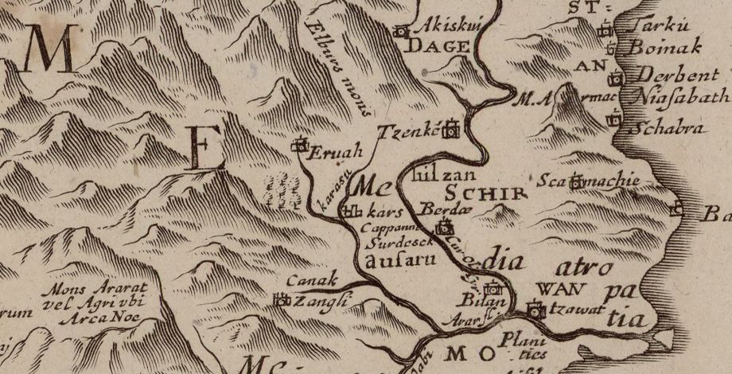

<!-- LTeX: language=fr -->

# Zoroastre se rend auprès d'Ormuzd [^1]

Lorsque Zoroastre eut trente ans, son cœur le porta vers l'Iran: mais il ne fit alors qu'y passer.

Zoroastre partit donc d'Urmi & arriva sur les bords du fleuve Araxe; puis il passa le Cyrus et arriva après plusieurs jours de marche sur le bord de cette mer profonde nommée Daëti [^2].

Il y entra sans rien craindre, & eut d’abord de l'eau jusqu’au talon, ensuite jusqu'au genou, puis jusqu’au milieu du corps & enfin jusqu’au cou.

Zoroastre se lava la tête & le corps dans le Daëti et rendit grâces à Ormuzd après l’avoir passé.

Il se retira ensuite dans les montagnes de l’effrayant Albordj [^3] pour consulter l’Être Suprême, & contempler plus tranquillement les vérités qu’il allait annoncer à sa patrie.

Alors, Bahman éclatant comme le Soleil, & la main couverte d’un voile, se présenta à Zoroastre par l’ordre d'Ormuzd, & lui dit:

> qui êtes-vous ?
>
> que demandez-vous?

Zoroastre lui répondit:

> je ne cherche que ce qui plaît à Ormuzd qui a fait les deux Mondes;
>
> mais je ne sais ce qu'il veut de moi.
>
> Ô vous qui êtes pur, montrez-moi le chemin de la Loi.

Ces paroles plûrent à Bahman. Il répondit à Zoroastre:

> Levez-vous, pour aller devant Dieu.
>
> Là, vous recevrez la réponse à ce que vous demandez.

Zoroastre se leva & suivit Bahman, qui lui dit:

> Fermez les yeux, & marchez promptement.

Vous eussiez dit qu'un oiseau l’enlevait & le portait devant Dieu.

Lorsque Zoroastre ouvrit les yeux, il vit la gloire du Ciel: les Anges vinrent en grand nombre à sa rencontre, chacun lui demandait quelque chose, le montrait du doigt.

Étant arrivé près de Dieu, il lui adressa d’abord sa prière, & le consulta ensuite sur différents sujets, comme avait fait Djemschid.

Zoroastre demanda à l'Être Suprême, quel était dans le Monde le meilleur de ses serviteurs.

Dieu qui a toujours été, & qui sera toujours, lui répondit:

> C’est celui dont le cœur est droit.
>
> C'est celui qui est libéral à l'égard du Juste, de tous les hommes, & dont les yeux ne sont pas tourné vers les richesses.
>
> C'est celui dont le cœur fait du bien à tout ce qui est dans le Monde; par exemple, au feu, à l'eau, aux animaux: il sera éternellement heureux.
>
> Je n’approuve pas, que l'on chagrine ce qui est bon: celui qui afflige mes serviteurs, & qui marche hors de mes préceptes, dites-le aux Peuples, sa place est pour toujours dans l'Enfer.

Zoroastre consulta ensuite Ormuzd sur les Amschaspands [^4] qui lui sont agréables, sur l'impur Ahriman qui ne pense que le mal, sur le bien, sur le mal, & sur la fin destinée à ceux qui suivent la voie des Dews.

Ormuzd lui dit:

> C'est moi qui montre le bien.
>
> Ahriman est l’auteur du mal: mon intention n’est pas que les Peuples soient dans l’affliction.
>
> Sachez que le mal ne vient que d’Ahriman, ainsi que les mauvaises actions & les mauvaises pensées.
>
> La punition qui attend le pécheur est aux Enfers: les insensés mentent, lorsqu'ils disent que je fais le mal.

Zoroastre pria Ormuzd de lui donner l’immortalité, pour qu'il pût confirmer les hommes de tous les siècles dans la pratique de la Loi.

Mais Ormuzd lui répondit:

> Si je vous rends immortel, le corps du Dew Tourberatorsch le sera aussi ; & alors il n'y aura pas de résurrection.
>
> Si je vous accordais l’immortalité, vous me demanderiez vous-même la mort.

Ormuzd lui présenta en même temps quelque chose de semblable à du miel;

Zoroastre le mangea, & vit comme en songe les cœurs & les pensées des hommes à découvert.

Ormuzd lui montra tous les évènements depuis le premier homme jusqu’à la résurrection, & ce qui devait arriver dans le dernier mille du Monde.

A la vue des maux & des crimes qui allaient désoler la Terre, Zoroastre consentit à ne pas être immortel.

Ormuzd lui apprit encore ce qui concernait la révolution du Ciel, l’influence bonne ou mauvaise des Astres, les secrets de la Nature, la grandeur des Amschaspands & le bonheur égal dont tous les Êtres doivent jouir dans le Ciel.

Zoroastre vit dans l'Enfer le visage du mauvais Ahriman, & délivra de ce séjour ténébreux une personne qui avait fait le bien & le mal [^5].

Ahriman l'ayant aperçu, poussa un grand cri, en disant:

> Quittez cette Loi pure, jetez-la dans la poussière.
>
> Vous aurez dans le Monde tout ce que vous pouvez désirer.
>
> Ne vous inquiétez pas de votre fin, ou du moins ne détruisez pas mon peuple, ô pur Zoroastre, vous fils de Poroschasp, qui êtes né de celle qui vous a porté.

Zoroastre lui répondit

> Mauvaise gloire, c’est à toi & à tes Sectateurs que l'Enfer convient;
>
> mais par la miséricorde de Dieu, je couvrirai ton œuvre de honte & d’ignominie.

Lorsque Zoroastre fut rempli de la connaissance de Dieu, il vit une montagne de feu, & il lui fut ordonné de passer dedans: il la traversa, sans que fon corps en reçut la moindre atteinte.

On fit fondre ensuite différents métaux, on les lui versa sur le corps; & il ne perdit pas un seul poil.

Après cela on lui ouvrit le ventre; on en tira ce qui y était: tout cela se fit par l'ordre d'Ormuzd.

Celui que Dieu protège, le fer dans sa main est comme la cire: il n'a rien à craindre ni de l’eau, ni du feu.

Ormuzd dit à Zoroastre:

> Apprenez aux Peuples ce que vous avez vu, vous qui êtes leur Pasteur.
>
> Celui qui suivra la voie impure d’Ahriman, comme vous avez traversé une montagne de feu, & qu'on vous a ouvert le ventre, il coulera de son corps des flots de sang, son corps sera livré à des flammes brulantes.
>
> Pour ce qui est du fleuve de métaux fondus, qui n’a pu endommager un seul de vos cheveux, voici ce que cela signifie: une génération quittera la Loi, pour suivre la voie d’Ahriman.
>
> Mais les Mobeds s’armeront pour combattre les Dews. Le doute s'emparera du cœur des hommes, & ce fleuve brûlant les dissipera.
>
> Aderbad Mahrespand [^6] paraîtra, il instruira les hommes de tout ce qu'ils doivent savoir: on lui versera sur le corps des métaux fondus, qui ne lui feront aucun mal.
>
> Ce prodige dissipera les doutes, & fera connaître la voie droite.

Après cela Zoroastre consulta celui qui sait les secrets, sur les devoirs de ses serviteurs, les Destours et les vigilants Mobeds.

Il lui demanda:

> Comment faut-il prier?
>
> Que doit dire celui qui veut faire Afrin [^7], & de quel côté, en priant, doit-on tourner le visage?

L'Être qui donne la nourriture de chaque jour, & qui n’a besoin de rien, répondit à Zoroastre:

> Apprenez aux Peuples que ma lumière est cachée sous tout ce qui brille.
>
> Lorsque vous tournerez le visage du côté de la lumière, & que vous exécuterez mes ordres, vous ferez fuir Ahriman: dans le monde, il n’y a rien au-dessus de la lumière.

Ensuite Ormuzd enseigna à Zoroastre le Zend-Avesta, & lui dit:

> Prononcez-le devant le Roi Guschtasp, pour qu'il protège la Loi.
>
> Apprenez-lui à me connaître.
>
> Qu’il soit plein de bonté & de miséricorde: montrez à Guschtasp tout ce que je vous ai enseigné.
>
> Instruisez de ma part tous les Mobeds: dites-leur de s’éloigner de la voie d’Ahriman: récitez mes paroles; les Dews et les Magiciens se cacheront devant elle.

Ces instructions remplirent de joie Zoroastre; il remercia Ormuzd qui montre & donne la pureté.

Ormuzd dit ensuite à Zoroastre:

> Vous triompherez de tous vos Adversaires.
>
> Il y a dans l’Indoustan un Brahme nommé Tchengréghatchah; personne ne l’ égale en sagesse: telles sont les questions qu’il vous fera, & telles sont les réponses à ces questions. Ce Nosk du Zend-Avesta comprend les réponses à tout ce que Tchengréghatchah aura médité & recherché avec beaucoup de peine pendant plusieurs années.

Lorsqu’il sortit de la présence d'Ormuzd le cœur satisfait, l'Amschaspand Bahman, qui veille sur les animaux, vint au-devant de lui, & lui dit:

> Je vous livre les animaux & les troupeaux: que les Mobeds apprennent à en avoir soin.
>
> Il ne faut tuer ni les animaux jeunes, ni ceux qui sont encore utiles.
>
> Dites cela aux jeunes; dites-le aux vieux.
>
> Je vous apprends ce qu'il est nécessaire de savoir, moi qui ai reçu les animaux des mains d'Ormuzd: il ne faut pas les confier à de mauvais gardiens.

Bahman quittat Zoroastre, lorsque le brillant Ardibehescht l’aborda, & lui dit:

> Serviteur du Dieu pur, parlez de ma part au Roi Guschtasp, & dites-lui:
>
> > je vous ai confié tous les feux.
> >
> > Ordonnez aux Mobeds, aux Destours, aux Herbeds d’en avoir soin, de ne les éteindre ni dans l’eau, ni dans la boue; d’avoir dans chaque ville un Atesch-gâh [^8] & de célébrer en l'honneur de cet élément les fêtes ordonnées par la Loi: car l'éclat du feu vient de celui de Dieu.
>
> Qu'y a-t-il de plus beau dans le Monde?
>
> Il ne demande que du bois, des odeurs: que le jeune & le vieux lui en donnent, & il les exaucera.
>
> Je vous le livre, comme Ormuzd me l’a remis.
>
> Celui qui n’exécutera pas mes paroles, ira en Enfer.

Zoroastre, quittant Ardibehescht, aperçut Schahriver qui venait à lui.

Cet Amschaspand lui dit:

> Ô pur, lorsque vous serez sur la Terre, annoncez mes paroles aux hommes;
>
> que celui qui a des armes, une épée, une lance, une massue, un poignard, les nettoient tous les ans.
>
> La vue de ces armes fait fuir ceux qui ont de mauvais desseins; il ne faut les confier ni au méchant, ni à l'ennemi.

Espendarmad vint ensuite trouver Zoroastre, lui fit différents souhaits, & lui dit:

> Ô homme de la Loi pure, l'ordre de celui qui bénit les hommes, est qu'ils préservent la Terre du sang, des immondices & des morts.
>
> Portez tout cela dans les endroits où la terre n’est pas labourée, où l’eau & les hommes ne passent pas.
>
> Des fruits sans nombre seront la récompense du travail & du labour.
>
> Le meilleur Roi, est celui qui rend la Terre fertile.
>
> Dites cela aux hommes.

Zoroastre n'eut pas plutôt quitté Espendarmad, que Khordad [^9] se présenta à lui, & lui dit:

> je vous confie l'eau qui coule, l’eau creusée, l'eau des fleuves, celle qui vient de loin, des montagnes, l’eau des puits & des sources.
>
> Apprenez aux hommes que l’eau donne la force aux êtres animés, qu'elle fait tout verdir.
>
> Il ne faut rien y mêler de mort, ni d'impur.
>
> Que votre nourriture cuite avec de l'eau pure, soit sainte.
>
> Exécutez ainsi les ordres du grand Ormuzd.

Lorsque Khordad eut achevé, Amerdad parla à Zoroastre au sujet des fruits & des arbres. Il lui dit:

> Il ne faut pas les gâter, ni les arracher sans raison, parce qu'ils font le bonheur de l'homme & des quadrupèdes.

Zoroastre reçut encore les instructions suivantes des Esprits célestes:

> Recommandez aux Destours d’aller dans le Monde entier, & de porter les hommes à embrasser la Loi que vous avez reçue d’Ormuzd.
>
> Etablissez dans chaque lieu un Docteur qui enseigne la Loi & la Justice, qui récite l’Avesta, & prie le Créateur du Monde.
>
> Que tous les hommes se tournent du côté de la justice.
>
> Qu'ils ceignent le Kosti, qui est la marque des Disciples de la Loi sainte.
>
> Qu'ils conservent pures les quatre choses précieuses dont le corps de l’homme est composé, le vent, l'eau, le feu & la terre: alors tout sera heureux & béni de l'Être Suprême.

Lorsque Amerdad eut achevé, Salah parla à Zoroastre au sujet de l'âme. Il lui dit:

> Adore le Créateur de l’âme et de la raison, comme c’est ton devoir, et considère, ô sage à l’esprit brillant, s’il est possible de le célébrer comme il faudrait.
>
> Aucune doctrine ne vaut celle de l’unité de Dieu, et qu’on l’avoue ou qu’on le nie, il n’y a qu’un Dieu.
>
> Tout ce qui te passe devant les yeux se combine dans ton esprit avec les conclusions de la raison pour prouver son existence;
>
> Si donc tu es un homme qui réfléchisses, suis le chemin déjà essayé;
>
> Sinon abstiens-toi au moins de disputes.
>
> Un souffle t’a fait naître composé d’âme et de corps, et tu te crois un être très-puissant;
>
> Mais tes jours passeront, et un autre monde deviendra ta demeure.
>
> Pense avant tout au Créateur, et que ton adoration soit fondée sur cette pensée, que c’est par lui que subsiste le ciel qui tourne, que c’est lui qui est notre guide dans la bonne et la mauvaise fortune.
>
> Si tu veux réfléchir, tu verras que le monde est rempli de merveilles, et que personne ne peut entrer en guerre avec Dieu.
>
> L’âme est pleine de merveilles, et le corps est une merveille;
>
> Et il faut d’abord se connaître soi-même, et ensuite le ciel qui tourne au-dessus de nos têtes et qui nous montre chaque jour une face nouvelle.

Telles sont les instructions que Zoroastre reçut d’Ormuzd & des Esprits célestes ses Ministres.

[^1]: Cet épisode est tiré de la Vie de Zoroastre, traduit, de l'orignal Zend du Zend-Avesta, par Anquetil du Perron en 1760.
[^2]: La mer Caspienne.
[^3]: Plusieurs montagnes ont porté ce nom. Il y a l’Albordj de Géorgie située à l’ouest de la mer Caspienne. Il y a l’ Albordj dans le cœur de la Perse, dont le Pyrée est célèbre. Albordj signifie montagne élevée (heranm berézéetîm).  Extrait d'une carte de la Perse publiée en 1650 qui montre les fleuves Araxe et Cyrus, la côte ouest de la mer Caspienne et le mont Albordj.
[^4]: Les six premiers Esprits célestes après Ormuzd
[^5]: Quelques Parses croient qu'il est ici question de Djemschid qui, sur la fin de son règne, voulut se faire adorer, D'autres rapportent ce trait à Guerschasp, fameux guerrier, qui était en Enfer pour avoir frappé le feu.
[^6]: Trentième descendant de Zoroastre.
[^7]: C’est-à-dire adresser à Ormuzd des louanges accompagnées de remerciements.
[^8]: C'est-à-dire un lieu destiné au feu.
[^9]: Khordad chef des années, des mois, des jours, du temps, préside à l’eau pure.
