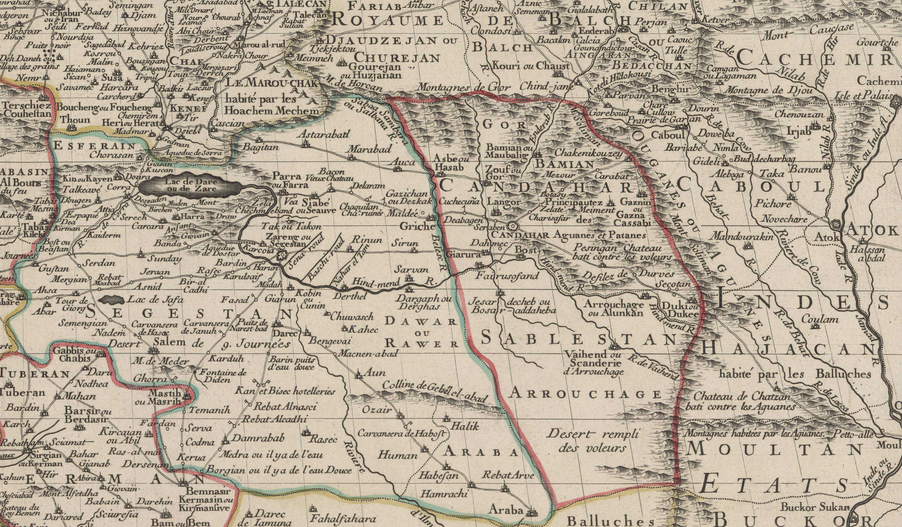
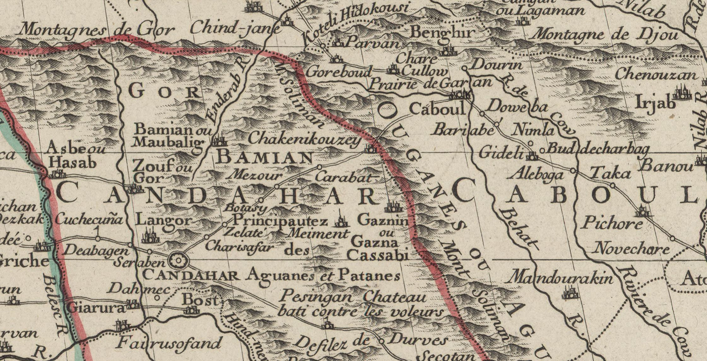

<!-- LTeX: language=fr -->

# Guschtasp se rend dans le Séistan et Ardjasp réunit de nouveau son armée

Ainsi se passa un long temps pendant lequel le roi se rendit dans le Séistan [^1], pour y introduire le Zendavesta et en prendre pour témoins les Mobeds.

Lorsque le roi illustre y arriva, le Pehlewan de l’armée, Rustem, le roi du Nimrouz, le cavalier plein d’expérience, l’égal de Sam, vint à sa rencontre avec son père, le vieux Destan, avec ses grands et tous les chefs de son armée;

Ils placèrent sur les routes, d’une frontière à l’autre, des musiciens qui jouèrent de leurs instruments;

Ils allèrent joyeusement au-devant de lui, et le fortuné roi en fut réjoui; ils le conduisirent à Zaboul comme leur hôte, se tenant tous debout devant lui ainsi que des esclaves;

Ils apprirent la doctrine du Zendavesta, se revêtirent du koschti et allumèrent le feu sacré.

Deux ans se passèrent pendant cette visite, et durant ce temps Guschtasp et le fils de Zal jouirent de la vie.

Mais tous les rois, quelque part qu’ils fussent, apprirent ce que Guschtasp avait fait; ils apprirent qu’il avait mis dans les chaînes le Pehlewan du monde, qu’il avait courbé sous les fers le corps héroïque de son fils, qu’il était allé dans le Zaboulistan pour répandre sa religion et maudire les puissantes idoles, et tous se révoltèrent contre lui, tous brisèrent les traités qui les liaient envers lui.

Lorsque Bahman eut appris que son père illustre avait été enchainé par ordre du roi, sans avoir commis de faute, lui et ses frères licencièrent leur armée et prirent la longue route de Gunbedan: ils arrivèrent auprès d’Isfendiar.

Ces fils du Keïanide arrivèrent comme des lions, et demeurèrent auprès de lui pour l’égayer; ils ne voulurent pas le laisser seul dans sa prison.

Cependant le roi de la Chine fut informé que la lune avait disparu du signe du Sagittaire, que Guschtasp s’était mis en colère contre Isfendiar, qu’il l’avait envoyé ignominieusement en prison et chargé de chaînes, que lui-même était allé de Balkh dans
le Zaboulistan, qu’il avait traversé le désert et passé le Djihoun, qu’il était établi à Zaboul [^2] comme hôte de Zal, et que deux années s’étaient déjà passées ainsi; qu’à Balkh il ne restait des Iraniens et de leur armée que le roi Lohrasp, avec sept cents adorateurs du feu, tous uniquement occupés à prier devant l’autel , qu’ils étaient seuls dans la ville, sans aucun des grands, excepté les gardiens du palais de Homaï, et qu’en conséquence il fallait se lever sans aucun retard.

Le maître de Djiguil appela tous ses grands et se prépara à attaquer Lohrasp. Il leur dit:

> Sachez que le roi Guschtasp est allé dans le Séistan avec son armée;
>
> il s’est établi avec elle à Zaboul, et dans tout son royaume il n’y a pas un cavalier.
>
> C’est le moment de prendre une revanche, et il nous faut ce mettre sur pied une grande armée.
>
> Le noble Isfendiar, son fils, est en prison et chargé de lourdes chaînes.
>
> Quel est l’homme habile à approfondir les secrets qui veut explorer cette longue route, la parcourir avec des détours et en évitant les chemins fréquentés, et examiner la situation des Iraniens?

Or il y avait un magicien nommé Sutouh, qui, savait passer par tous les chemins et pénétrer tous les secrets; il dit:

> Je suis un homme souple et toujours prêt pour la route;
>
> Que faut-il faire?
>
> Dis-moi tout ce qu’il faut.

Le roi de la Chine lui répondit:

> Va dans l’Iran, observe avec intelligence et pénètre partout.

L’espion parcourut toute la route et entra dans Balkh la glorieuse, pour voir si le roi y était.

Il n’y trouva pas Guschtasp, et ne vit que Lohrasp et des hommes qui adoraient;

Il s’en retourna auprès du Khakan, et lui raconta comment il avait appris cela en secret.

Ardjasp fut heureux de ces nouvelles, et se sentit délivré de ses longs soucis; il appela auprès de lui tous les chefs de l’armée, et leur ordonna de partir et de rassembler leurs troupes dispersées.

Tous les héros se mirent en route pour les montagnes et les plaines et pour les pâturages des troupeaux, et rappelèrent auprès du roi son armée, les cavaliers choisis de son empire.

[^1]: Séistan (Segestan)  Extrait d'une carte de la Perse publiée en 1724 qui montre le Séistan et le Zaboulistan (Sablestan).
[^2]: Zaboul serait la ville de Gazna qui est située à l'occident de Kaboul.  Extrait d'une carte de la Perse publiée en 1724 qui montre la partie nord du Zaboulistan.
