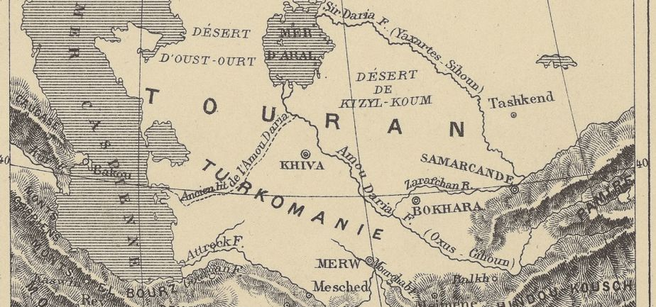

<!-- LTeX: language=fr -->

# Zerir répond à Ardjasp

Pendant que le roi prononçait ces paroles, le Sipehdar Zerir et Isfendiar tirèrent leurs épées et s’écrièrent:

> S’il y a quelqu’un dans le monde entier qui refuse de reconnaître Zerdouscht comme prophète, qui ne veuille pas se soumettre à ses ordres, qui ne vienne pas à la cour du bienheureux roi, qui ne se tienne pas, ceint comme un serviteur, devant son trône brillant, qui n’adopte pas de lui la vraie voie et la bonne doctrine, qui ne soit pas le serviteur de la vraie religion, nous lui ferons rendre l’âme avec nos épées, nous suspendrons sa tête au plus haut gibet.

Zerir, le Sipehdar de l’Iran , le vaillant cavalier, le lion bondissant, dit au roi de la terre:

> Ô roi illustre!
>
> Si tu veux m’en donner la permission, je répondrai à Ardjasp le magicien.

Le roi Guschtasp y consentit et lui dit:

> Eh bien, pars; fais-lui sur le-champ une réponse, et fais-la-lui telle qu’elle brûle tous les braves de Khallakh comme un charbon ardent.

Zerir, le noble Isfendiar et Djamasp, le Destour heureux en toute chose, le quittèrent tous les trois ensemble, leurs visages froncés, leurs cœurs pleins de colère.

Ils adressèrent à Ardjasp une lettre sévère, une réponse telle que sa lettre l’avait méritée.

Le Sipehbed Zerir la prit dans sa main et l’emporta tout ouverte et sans la plier.

Il la porta au roi et la lui lut, et Guschtasp, le maître du monde, resta confondu d’admiration pour le sage Sipehbed Zerir, le cavalier, pour Djamasp et Isfendiar, le fils du roi.

Il ferma la lettre et écrivit son nom dessus; on appela auprès de lui les messagers, et il leur dit:

> Prenez ma réponse et portez-la-lui, et ne mettez plus jamais les pieds sur le chemin qui conduit chez moi;
>
> si le Zendavesta ne garantissait pas de tout mal les messagers, je vous aurais réveillés de votre sommeil, je vous aurais pendus vivants au gibet.
>
> Puisse cet homme sans valeur apprendre par tout ceci qu’il ne doit point lever la tête en face du roi!

Il leur jeta la lettre en ajoutant:

> Partez, et portez ceci à ce Turc magicien; dites-lui que sa perte est proche, que le moment arrive où l’eau et la terre lui manqueront.
>
> Puisse son cou être frappé et sa taille brisée, puissent ses os être dispersés dans la terre!
>
> S’il plaît à Dieu, je revêtirait pour le combat encore dans ce mois-ci ma cotte de mailles de fer, je mènerait mon armée dans le royaume de Touran [^1], je dévasterai le pays des Kergsars.

[^1]: carte du Touran 
