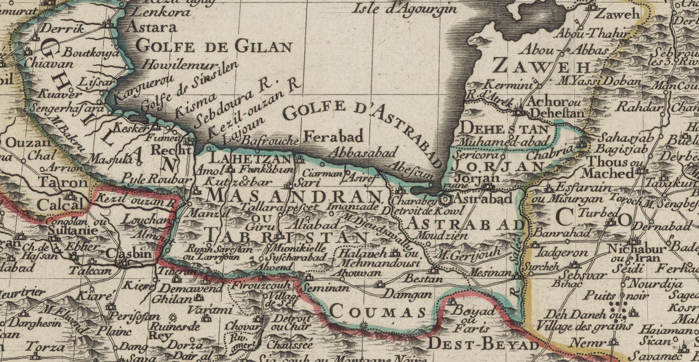

<!-- LTeX: language=fr -->

# Rustem se vante de ses hauts faits

Rustem répondit à Isfendiar:

> Mes actions resteront comme souvenir de moi.
>
> Sois juste envers moi, et écoute un vieillard couvert de gloire.
>
> Si je n’étais pas allé dans le Mazenderan [^1], portant sur mon épaule ma lourde massue, là ou le roi, Gouderz et Thous étaient prisonniers, et où le chagrin avait rendu trouble l’œil du coq, qui aurait arraché le cœur au Div blanc et répandu sa cervelle, qui pouvait espérer faire cela par la force de son bras?
>
> Je l’ai délivré de ses lourdes chaînes et l’ai porté sur son trône;
>
> L'Iran était heureux sous lui, et la fortune le favorisait;
>
> J’ai tranché la tête aux magiciens, et ils n’ont eu ni cercueil, ni tombe, ni linceul.
>
> Raksch a été mon compagnon dans les sept aventures; Raksch, qui par la force de son sabot était le distributeur du monde.
>
> Ensuite, quand Kaous fut allé dans le Hamaveran, et qu’on eut lié ses pieds de lourdes chaînes, j’y ai mené une armée d’Iraniens, tirée de tout lieu où il y avait un prince ou un chef; j’ai tué dans le combat le roi du Hamaveran, j’ai rendu vide son trône illustre.
>
> Kaous, le maître du monde, était enchaîné, il était abattu par les fatigues et les soucis, et Afrasiab pendant ce temps avait envahi l'Iran, et le monde était rempli de tristesse et de maux infligés par les méchants.
>
> Pendant une nuit sombre, j’ai devancé tout seul l’armée, car je cherchais la gloire et non pas le repos, et lorsque Afrasiab vit mon drapeau brillant, que son oreille fut frappée du hennissement de Raksch, il quitta l'Iran, s’enfuit vers la Chine, et la justice régna dans le monde, qui était plein de bénédictions.
>
> Si le sang avait coulé des membres de Kaous, comment Siawusch serait-il né de lui? alors Keï Khosrou n’aurait pu être mis au monde par sa sainte mère, lui qui a placé la couronne sur la tête de Lohrasp.
>
> Comment peux-tu te targuer de cette couronne de Lohrasp, et du collier et du trône de Guschtasp, qui ose dire:
>
> > Va et enchaine Rustem?
>
> Car le puissant ciel lui-même ne peut m’enchaîner;
>
> Et si j’étais un autre homme, où seraient votre couronne, votre collier et votre trône d’ivoire?
>
> Tu es un Pehlewan nouveau dans le monde, avec des manières nouvelles, tu es fils de Keï Khosrou;
>
> Mais, depuis mon enfance jusqu’à ma vieillesse, personne n’a osé me parler comme toi.
>
> Je serais honteux de m’excuser et de supplier: je me sens déjà déshonoré de ce que je réponds si doucement.

Isfendiar sourit de la violence de Rustem, il étendit la main et saisit fortement la sienne, disant:

> Ô Rustem, au corps d’éléphant!
>
> Tu es tel qu’on me l’a dit dans l’assemblée des grands;
>
> Ton bras est fort comme le bras d’un lion;
>
> Ta poitrine et tes membres sont ceux d’un vaillant dragon, ta taille est mince et souple comme celle du léopard, et où est le brave qui oserait t’affronter au jour du combat?

Tout en parlant, il serra la main de Rustem, mais le vieillard sourit au jeune homme; le sang coulait de ses ongles, mais le héros ne se tordit pas sous cette douleur.

Il saisit, à son tour, la main du prince, disant:

> Ô roi qui adore Dieu! heureux Guschtasp, le glorieux roi, d’avoir un fils comme Isfendiar;
>
> Heureux celui à qui naît un pareil fils! il sera comblé des gloires de la terre.

Pendant ces paroles il serrait la main du prince au point que le visage du Sipehbed devint pourpre, que ses ongles furent inondés de sang, et que ses sourcils se froncèrent; mais le fortuné Isfendiar sourit, disant:

> Ô glorieux Rustem!
>
> Bois aujourd’hui du vin, car demain tu reculeras dans le combat, et personne ne boira à ta santé dans le festin.
>
> Quand j’aurai placé la selle d’or sur mon destrier noir, quand j’aurai couvert ma tête de mon casque royal, je t’enlèverai avec ma lance de dessus ton cheval et te jetterai sur le sol;
>
> Mais après cela je ne te combattrai plus ni ne te garderai rancune.
>
> Je te lierai les deux mains, je t’amènerai devant le roi et lui dirai que je n’ai pas trouvé de faute en toi;
>
> Je me présenterai devant le roi en suppliant, je plaiderai ta cause de toute manière, je te délivrerai de ce chagrin, de cette douleur et de cette peine, je t’en récompenserai par des trésors sans nombre.

Rustem sourit et dit à Isfendiar:

> Tu en auras assez de la lutte.
>
> Où as-tu donc vu un combat de braves, où as-tu entendu le sifflement d’une lourde massue?
>
> Si le ciel tourne de cette façon, s’il efface tout sentiment de tendresse entre deux hommes, alors combattons au lieu de boire du vin rouge;
>
> Servons-nous de nos arcs, de nos lacets et de nos ruses de guerre;
>
> Faisons entendre les timbales au lieu des sons de la musique;
>
> Saluons-nous avec l’épée et la masse d’armes;
>
> Alors, ô fortuné Isfendiar, tu verras ce que sont les luttes et les chances d’un combat.
>
> Quand je paraîtrai demain sur le champ de bataille, nous lutterons homme contre homme, je t’enlèverai dans mes bras de dessus ton cheval et te porterai ainsi devant Zal, je te ferai asseoir sur son célèbre trône d’ivoire, je placerai sur ta tête la couronne qui réjouit les cœurs et que j’ai reçue de Keï Kobad, puisse son âme être heureuse dans le ciel!
>
> J’ouvrirai la porte de mon trésor, je placerai devant toi, dans sa magnificence, tout ce que je possède de précieux, je mettrai ton armée au-dessus de tout besoin, j’élèverai ton casque jusque dans les nues.
>
> Ensuite nous partirons pour la cour du roi, entourés de pompe, jouant et nous réjouissant en route;
>
> Je poserai bravement la couronne sur ta tête, et c’est ainsi que je remercierai Guschtasp.
>
> Ensuite je me ceindrai comme un esclave, comme je me suis ceint devant les Keïanides, j’arracherai du jardin de mon cœur toute mauvaise herbe;
>
> Mon corps sera rajeuni par la joie, et quand tu seras roi et moi ton Pehlewan, il n’y aura personne qui ne soit transporté de joie.

[^1]: Carte du Mazenderan 
