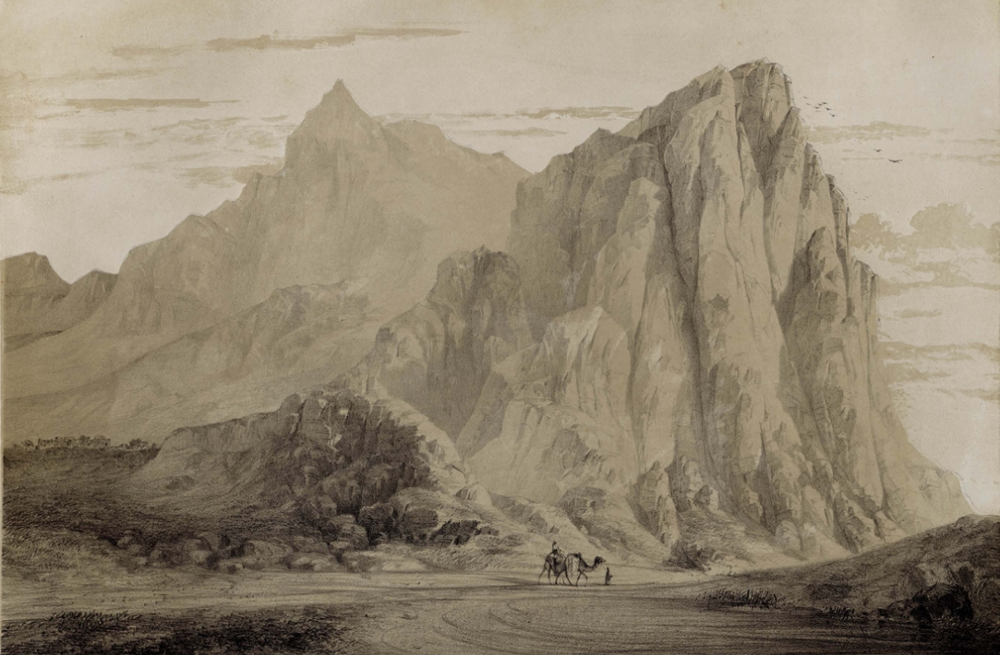
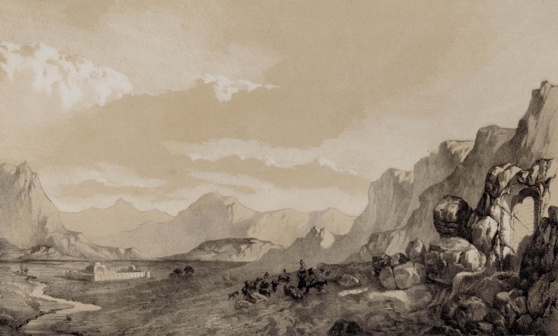
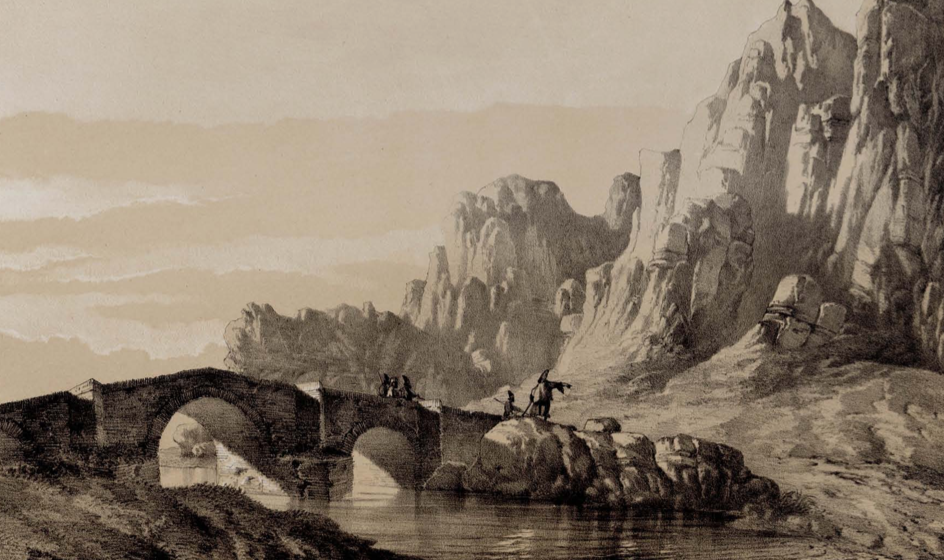

<!-- LTeX: language=fr -->

# Mont Bisoutoun

Le mont Bi-Sutoun s'élève en forme pyramidale, noir et sauvage. C'est l'un des sommets les plus élevés de la chaîne qui, de ce point, se prolonge jusque vers les monts Zagros, à l'ouest de Kirmanschah.

Bi-Sutoun signifie, au sens littéral, sans colonnes.

Pour justifier cette dénomination actuelle, il faut croire qu'elle a été donnée à la suite d'un acte de dévastation et d'incendie qui aurait été commis sur les monuments de cette localité, et dont le résultat aurait été la disparition complète de ses édifices ornés de colonnes.

Mont Bi-Sutoun, illustration d'Eugène Flandin - 1851

Caravansérail de Bi-Sutoun, illustration d'Eugène Flandin - 1851

Pont de Bi-Sutoun, illustration d'Eugène Flandin - 1851
